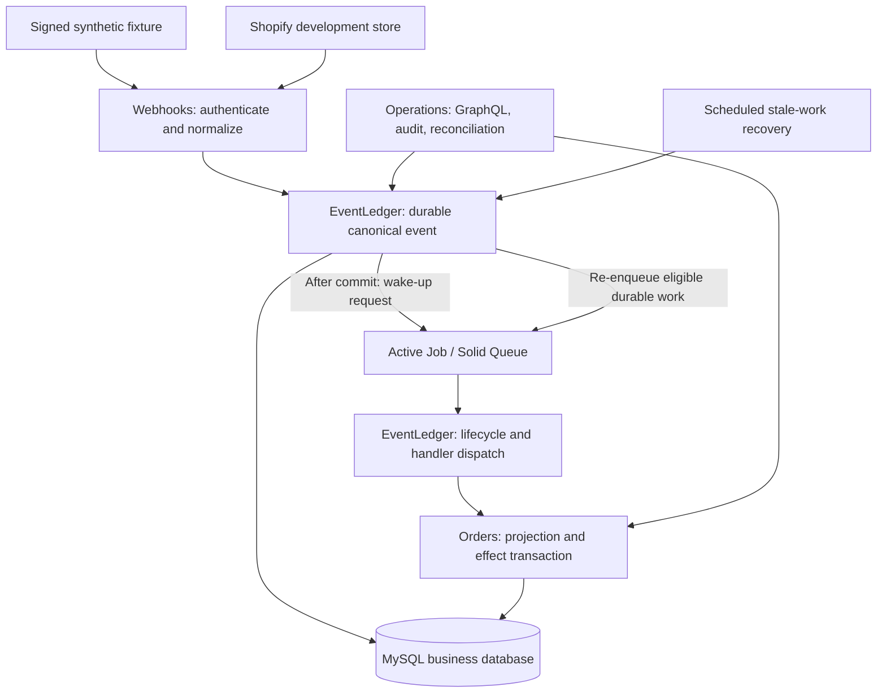

# Architecture

Status: Rails/MySQL scaffold and [four-package interface contracts](package-contracts.md) implemented; architecture baseline accepted in [ADR-0001](adr/0001-modular-monolith.md); detailed transaction/recovery design proposed in [ADR-0002](adr/0002-acceptance-and-recovery.md). The business schema, real event pipeline, and failure experiments below remain planned.

## System boundary

Commerce Event Ledger is a Rails API modular monolith. MySQL is the sole business source of truth. The scaffold pins Ruby 4.0.6, Rails 8.1.3.1 and MySQL 8.4.11 and commits the Bundler resolution. Minitest checks the real database connection and HTTP boot. Public interface tests and Packwerk checks establish the package boundary; the interface tests use explicit doubles for pending adapters. Active Job/Solid Queue execution and the GraphQL Ruby operator API remain future work.

The first domain effect is a local order projection update. This architecture does not execute payments or write orders/inventory in a merchant's system. The guarantee of one committed database effect is limited to writes enclosed in the same transaction as the effect ledger; it does not extend to network calls or other databases.

## Four packages

| Package | Owns | Public interactions and boundary |
| --- | --- | --- |
| `Webhooks` | HTTP endpoint, raw-body HMAC authentication, source adapter, normalized envelope | Submit an authenticated envelope through EventLedger's receipt interface. Must not write order projections or bypass ledger lifecycle rules. |
| `EventLedger` | Canonical receipt, deduplication, attempts, lifecycle, eligible-work discovery, handler contract | Expose receipt, tenant-scoped lookup, execution coordination, and recovery interfaces. Dispatch through a declared handler interface rather than accessing Orders internals. |
| `Orders` | Order projections, transition policy, handler-level database effects | Implement the handler interface and expose tenant-scoped projection reads. Projection changes and effect records share a MySQL transaction. |
| `Operations` | Operator authentication/authorization boundary, GraphQL queries and replay, reconciliation entry points, operator audit | Use the packages' public read/lifecycle APIs; require tenant scope and an attributable operator for replay. Must not patch domain tables directly. |

Dependency wiring and handler registration belong in the application composition boundary. Package code must not reach into another package's private models. The [package contracts](package-contracts.md) define immutable receipt/handler values, exact handler registration, tenant-scoped read ports, and the Orders transaction owner. The [HTTP receipt adapter](http-receipt.md) supplies trusted tenant configuration, exact-byte HMAC verification, and a committed MySQL canonical receipt. Processing, effects, and recovery remain downstream work. Packwerk must report zero violations and its negative probes must demonstrate enforcement.

## Planned business schema

| Table | Purpose and important constraints |
| --- | --- |
| `shops` | Tenant identity and reference to source credentials; secrets must never be serialized to logs or API results. |
| `received_events` | Canonical immutable source identity, normalized envelope, receipt/lifecycle metadata; unique `(shop_id, source, external_event_id)`. |
| `event_processing_attempts` | Attempt number, claim/lease token, timings, sanitized failure category, and outcome associated with the canonical event. |
| `processed_effects` | Unique `(event_id, handler_name, handler_version)` and the committed handler outcome. Recorded in the same business transaction as projection changes. |
| `order_projections` | Tenant/source order identity, current state, source version or source occurrence time, and tie-breaking metadata; unique tenant/source order identity. |
| `operator_actions` | Attributable operator, tenant, action, required reason, timestamp, original event association, and outcome; protected against ordinary mutation. |

All event and projection access must be tenant scoped. Foreign-key relationships, lock ordering, status indexes, stale-work query indexes, and retention policies require implementation review. Event IDs alone are not authorization. Do not expose raw payloads in the default GraphQL schema; any retained payload needs explicit retention, access, and redaction rules in the threat model.

## Receipt and acknowledgment

1. Resolve the source/tenant using trusted adapter configuration. A request-supplied shop identifier alone must not authorize a tenant.
2. Verify the HMAC over the exact raw request body using constant-time comparison before accepted-event persistence. Reject invalid signatures with `401`.
3. Normalize the supported topic into an envelope while preserving stable source identity and ordering information.
4. Insert or find the canonical event in a business-database transaction. A unique constraint resolves concurrent duplicate receipt; repeat deliveries update safe delivery metadata rather than create another event or effect. A conflicting payload under an existing event identity must not silently replace the canonical payload.
5. Commit durable receipt before acknowledging acceptance. Request enqueue after commit. The event record, not queue-job presence, is the source of recoverable work.
6. Return `202` only after durable receipt. A failed enqueue must remain discoverable by recovery. If receipt cannot commit, do not return `202`.

Receipt commit and job enqueue are separate boundaries in the proposed first implementation. Queue database placement or adapter settings must not be assumed to make them atomic. Recovery must close this gap and tests must demonstrate that behavior.

## Processing and ordering

A worker establishes a bounded claim and creates an inspectable attempt, then commits that claim transaction. It uses the canonical event's tenant and persisted handler identity to enter the handler path. Orders owns the private projection and effect models and a single MySQL transaction to serialize competing handlers, inspect the unique effect key, apply the permitted order transition, and write the effect outcome. EventLedger acknowledges the lifecycle outcome in a subsequent transaction guarded by the current claim token. It must not wrap the Orders transaction in an outer transaction.

Initial canonical receipt durably assigns a handler name/version selected by source/topic. Duplicate receipt, processing, and replay retain that exact identity. The registry must fail explicitly if the deployed code cannot resolve it; selecting a newer version would change the effect key and permit an unintended second effect.

Any uniqueness race or deadlock must be handled as a retryable/re-read path rather than permit the projection write to escape its transaction. A committed effect suppresses repeated application after a queue retry. A crash before commit rolls back both projection and effect; a crash after commit and before job acknowledgment leads to another processing attempt that observes the existing effect.

The source version/occurrence-time rule must be explicit for create, update, and cancellation. Stale events receive a recorded no-op outcome instead of regressing state. Equal timestamps, ambiguous ordering, missing source versions, and cancellation followed by a stale update require deterministic, documented tests; receipt time alone is not proof of source order.

## Retry, dead-letter, and recovery

Transient failures get bounded exponential backoff; unsupported or poison events ultimately enter dead-letter with a sanitized explanation. Attempts preserve the failure history. Retry limits and claim durations must be configurable and tested, not hidden assumptions.

Recovery periodically queries durable eligible pending/retry work and expired processing claims, including events whose first enqueue failed. It requests another job through Active Job. Duplicate enqueues are acceptable under at-least-once semantics. Claim ownership must be checked on lifecycle writes so an expired worker cannot overwrite a newer attempt's state; transaction locks and effect uniqueness remain the final duplicate-effect guards.

Reconciliation must not loop over healthy processing work or automatically revive deliberate dead-letter states. Its scheduling and restart behavior need a documented executable path. No custom transactional outbox is planned initially; an experiment demonstrating a concrete unmet requirement is needed before changing that decision.

## Operations and observability

GraphQL reads use authorized tenant scope, bounded pagination, and redacted event/attempt/projection representations. Replay requires an operator and reason and records an audit associated with the original canonical event. Replay re-requests processing; it must not delete effect records, invent a new event ID, or alter handler version merely to bypass idempotency. Any future handler-version migration is a separate reviewed domain change.

Correlate receipt, canonical event, attempt, job, and effect IDs in structured logs and traces. Instrument job lag, receipt latency, processing latency, retries, recovery requests, and dead-letter totals. Avoid secrets, raw bodies, sensitive error values, and unbounded identifiers in metric labels. Prove redaction on failure paths as well as successful processing.

## Evidence and limitations

Tests and failure injection must establish the [charter's completion criteria](project-charter.md#completion-criteria), including 100 duplicate deliveries, process restart, real development-store receipt, tenant isolation, and secret redaction. Load targets and coverage requirements are not measured facts at S0.

This initial design assumes a functioning durable MySQL database and an eventually running worker and recovery scheduler. Database disaster recovery, retention-induced loss, external side effects, regional outages, and production capacity are not proven guarantees. Document those limits in the threat model and release evidence.
